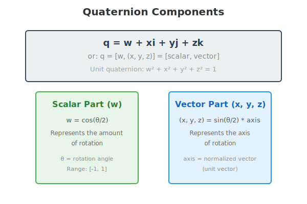
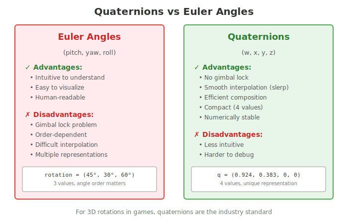
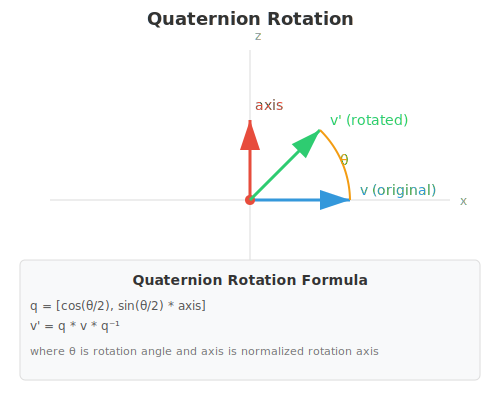

# Math References for C++ Game Development

> A dedicated file for essential math learning resources and cheat sheets. Useful for game developers working with physics, vectors, matrices, and other numerical concepts.
> Last Updated: 2025-12-18

---

## 📑 Table of Contents
- [Math Learning Resources](#math-learning-resources)
- [Books for Game Math](#books-for-game-math)
- [Cheat Sheets for Math Functions](#cheat-sheets-for-math-functions)
- [Quaternions for 3D Rotation](#quaternions-for-3d-rotation)
- [Math Practice & Examples](#math-practice--examples)
- [Interactive Tools](#interactive-tools)

---

## 🔓 Math Learning Resources

### Online Tutorials
- [Khan Academy - Trigonometry](https://www.khanacademy.org/math/trigonometry) - Learn sine, cosine, and tangent
- [Khan Academy - Linear Algebra](https://www.khanacademy.org/math/linear-algebra) - Vectors, matrices, and transformations
- [3Blue1Brown - Essence of Linear Algebra](https://www.youtube.com/playlist?list=PLZHQObOWTQDPD3MizzM2xVFitgF8hE_ab) - Visual explanations of vectors and matrices
- [Immersive Linear Algebra](http://immersivemath.com/ila/index.html) - Interactive linear algebra book

### Math-focused Channels
- **[Coding Math - YouTube](https://www.youtube.com/user/codingmath)** - Programming-based essential math tutorials
- **[Two-Bit Coding](https://www.youtube.com/c/TwoBitCoding)** - Vector, rotation, and physics examples
- **[Red Blob Games](https://www.redblobgames.com/)** - Visual and interactive explainer articles

### Articles
- [Math Primer for Game Developers](https://theorangeduck.com/page/linear-algebra-game-developers) - Simplified math essentials for devs
- [Wild Linear Transformations](https://eater.net/quaternions) - Visualizing rotation with quaternions

---

## 📚 Books for Game Math

- **"3D Math Primer for Graphics and Game Development" by Fletcher Dunn**
- **"Mathematics for 3D Game Programming" by Eric Lengyel**
- **"Essential Mathematics for Games and Interactive Applications" by James M. Van Verth**
- **"Game Engine Gems" (Series)** - Includes physics math chapters

---

## 🖊️ Cheat Sheets for Math Functions

### C++ STL Math Functions
```cpp
#include <cmath>

// Constants
const double PI = 3.14159265358979323846;

// Basic Trigonometric
std::sin(angle_radians);  // Sine
std::cos(angle_radians);  // Cosine
std::tan(angle_radians);  // Tangent
std::atan2(y, x);         // Arctangent (y/x) - Essential for look-at rotation

// Exponential, Power, Logarithm
std::pow(base, exponent);  // Power (base^exponent)
std::sqrt(value);          // Square Root
std::log(value);           // Natural Logarithm (ln)
std::exp(value);           // e^x

// Rounding/Clamping
std::round(value);   // Round to nearest integer
std::ceil(value);    // Round up
std::floor(value);   // Round down
std::fmod(n, d);     // Floating-point remainder of n/d

// Random Numbers (C++11+)
#include <random>
std::random_device rd;
std::mt19937 gen(rd());                  // Random number generator
std::uniform_real_distribution<> dis(0, 1); // Continuous random value [0,1]
std::uniform_int_distribution<> dis(0, 100); // Integer random value [0,100]

// Example Usage
float radians = PI / 2;  // Converting degrees to radians
float sine = std::sin(radians);
float rand_num = dis(gen);  // Generate a random number
```

---

### Vector Math Cheat Sheet
```cpp
#include <SFML/System/Vector2.hpp>
#include <cmath>

sf::Vector2f a(3.f, 4.f);
sf::Vector2f b(1.f, 2.f);

// Magnitude (Length)
float length = std::sqrt(a.x * a.x + a.y * a.y);

// Normalize (Unit Vector)
sf::Vector2f normalized = a / length;

// Dot Product (Angle Relation)
float dotProduct = a.x * b.x + a.y * b.y;

// Cross Product (2D "pseudo" cross product)
// Useful for determining if a point is left/right of a line or winding order
float cross = (a.x * b.y) - (a.y * b.x);

// Distance Between Two Points
float distance = std::sqrt(std::pow(b.x - a.x, 2) + std::pow(b.y - a.y, 2));

// Linear Interpolation (Lerp)
// Moves from 'start' to 'end' by factor 't' (0.0 to 1.0)
sf::Vector2f lerp(const sf::Vector2f& start, const sf::Vector2f& end, float t) {
    return start + (end - start) * t;
}
```

---

## 🔄 Quaternions for 3D Rotation

> Quaternions are a mathematical system for representing 3D rotations. They solve many problems associated with Euler angles (gimbal lock, interpolation) and are the industry standard for game development.

### 📚 What are Quaternions?

A quaternion is a 4-dimensional complex number that can represent rotations in 3D space:

**q = w + xi + yj + zk**

Or alternatively: **q = [w, (x, y, z)] = [scalar, vector]**

For rotations, we use **unit quaternions** where: **w² + x² + y² + z² = 1**



### 🎯 Why Use Quaternions?



**Advantages over Euler Angles:**
- ✅ **No Gimbal Lock** - Avoids the singularity problem where two rotation axes align
- ✅ **Smooth Interpolation** - Spherical linear interpolation (slerp) provides natural rotation
- ✅ **Efficient Composition** - Combining rotations is straightforward multiplication
- ✅ **Compact** - Only 4 values needed (vs 9 for rotation matrices)
- ✅ **Numerically Stable** - Less prone to floating-point errors

**Disadvantages:**
- ❌ Less intuitive than Euler angles
- ❌ Harder to visualize and debug
- ❌ Requires normalization to prevent drift

### 🔗 Learning Resources & References

#### Video Tutorials
- **[3Blue1Brown - Quaternions Visualized](https://www.youtube.com/watch?v=zjMuIxRvygQ)** ⭐ Best visual explanation
- **[Ben Eater - Visualizing Quaternions](https://eater.net/quaternions)** - Interactive 4D visualization
- **[Freya Holmér - Quaternions Explained](https://www.youtube.com/watch?v=CRiR2eY5R_s)** - For game developers
- **[Math for Game Developers - Quaternions](https://www.youtube.com/watch?v=jTgdKoQv738)** - Practical examples

#### Articles & Written Guides
- [Understanding Quaternions](https://www.3dgep.com/understanding-quaternions/) - Comprehensive tutorial
- [Quaternion Rotation Tutorial](https://danceswithcode.net/engineeringnotes/quaternions/quaternions.html) - Math-focused
- [Quaternions in Games](https://www.gamedeveloper.com/programming/rotating-objects-using-quaternions) - Game Developer Magazine
- [Red Blob Games - Rotation](https://www.redblobgames.com/articles/curved-paths/making-of.html) - Interactive examples

#### Books
- **"3D Math Primer for Graphics and Game Development"** by Fletcher Dunn - Chapter 8: Rotation in 3D
- **"Visualizing Quaternions"** by Andrew J. Hanson - Deep dive into quaternion mathematics
- **"Mathematics for 3D Game Programming"** by Eric Lengyel - Practical quaternion usage

#### Interactive Tools
- [Quaternion Visualizer](https://www.openprocessing.org/sketch/486473) - See quaternions in action
- [Quaternion Calculator](https://www.andre-gaschler.com/rotationconverter/) - Convert between rotation representations
- [3D Rotation Converter](https://www.euclideanspace.com/maths/geometry/rotations/conversions/index.htm) - Euler ↔ Quaternion

### 🧮 Mathematical Formulas

#### Creating a Quaternion from Axis-Angle

To create a quaternion from a rotation axis and angle:

```
Given: axis = (ax, ay, az) [normalized], angle = θ

q.w = cos(θ/2)
q.x = sin(θ/2) * ax
q.y = sin(θ/2) * ay
q.z = sin(θ/2) * az
```



#### Quaternion Operations

**Multiplication (Composition):**
```
q1 * q2 = [w1*w2 - v1·v2, w1*v2 + w2*v1 + v1×v2]
where v1·v2 is dot product and v1×v2 is cross product
```

**Conjugate (Inverse for unit quaternions):**
```
q* = [w, -x, -y, -z]
```

**Magnitude:**
```
|q| = √(w² + x² + y² + z²)
```

**Normalization:**
```
q_normalized = q / |q|
```

**Rotating a Vector:**
```
v' = q * v * q⁻¹
where v is treated as quaternion [0, vx, vy, vz]
```

### 💻 C++ Quaternion Cheat Sheet

#### Using GLM (OpenGL Mathematics)

```cpp
#include <glm/glm.hpp>
#include <glm/gtc/quaternion.hpp>
#include <glm/gtx/quaternion.hpp>

// Create identity quaternion (no rotation)
glm::quat identity = glm::quat(1.0f, 0.0f, 0.0f, 0.0f);

// Create from axis-angle (angle in radians)
glm::vec3 axis(0.0f, 1.0f, 0.0f);  // Y-axis
float angle = glm::radians(45.0f);   // 45 degrees
glm::quat rotation = glm::angleAxis(angle, axis);

// Create from Euler angles (pitch, yaw, roll)
glm::vec3 eulerAngles(glm::radians(30.0f), glm::radians(45.0f), glm::radians(60.0f));
glm::quat fromEuler = glm::quat(eulerAngles);

// Convert quaternion to Euler angles
glm::vec3 toEuler = glm::eulerAngles(rotation);

// Convert quaternion to rotation matrix
glm::mat4 rotationMatrix = glm::toMat4(rotation);

// Rotate a vector
glm::vec3 vector(1.0f, 0.0f, 0.0f);
glm::vec3 rotatedVector = rotation * vector;

// Combine rotations (right to left)
glm::quat q1 = glm::angleAxis(glm::radians(30.0f), glm::vec3(1, 0, 0));
glm::quat q2 = glm::angleAxis(glm::radians(45.0f), glm::vec3(0, 1, 0));
glm::quat combined = q2 * q1;  // Apply q1 first, then q2

// Inverse (for unit quaternions, conjugate is the inverse)
glm::quat inverse = glm::inverse(rotation);
// or
glm::quat conjugate = glm::conjugate(rotation);

// Normalize (important after many operations to prevent drift)
glm::quat normalized = glm::normalize(rotation);

// Spherical Linear Interpolation (slerp) - smooth rotation
glm::quat start = glm::quat(1, 0, 0, 0);
glm::quat end = glm::angleAxis(glm::radians(90.0f), glm::vec3(0, 1, 0));
float t = 0.5f;  // 50% between start and end
glm::quat interpolated = glm::slerp(start, end, t);

// Get rotation angle
float rotationAngle = glm::angle(rotation);  // in radians

// Get rotation axis
glm::vec3 rotationAxis = glm::axis(rotation);

// Dot product (measures similarity between rotations)
float similarity = glm::dot(q1, q2);
```

#### Using Eigen Library

```cpp
#include <Eigen/Geometry>

// Create quaternion from axis-angle
Eigen::Vector3f axis(0, 1, 0);
float angle = M_PI / 4;  // 45 degrees in radians
Eigen::Quaternionf q(Eigen::AngleAxisf(angle, axis));

// Create from rotation matrix
Eigen::Matrix3f rotMat;
Eigen::Quaternionf q2(rotMat);

// Rotate a vector
Eigen::Vector3f v(1, 0, 0);
Eigen::Vector3f rotated = q * v;

// Combine rotations
Eigen::Quaternionf combined = q1 * q2;

// Inverse
Eigen::Quaternionf inv = q.inverse();

// Slerp
Eigen::Quaternionf interpolated = q1.slerp(0.5f, q2);

// Normalize
q.normalize();
```

#### Manual Implementation (Understanding the Math)

```cpp
#include <cmath>

struct Quaternion {
    float w, x, y, z;
    
    // Constructor from axis-angle
    static Quaternion fromAxisAngle(float ax, float ay, float az, float angle) {
        float halfAngle = angle * 0.5f;
        float s = std::sin(halfAngle);
        return {
            std::cos(halfAngle),
            ax * s,
            ay * s,
            az * s
        };
    }
    
    // Multiply two quaternions (composition)
    Quaternion operator*(const Quaternion& q) const {
        return {
            w*q.w - x*q.x - y*q.y - z*q.z,
            w*q.x + x*q.w + y*q.z - z*q.y,
            w*q.y - x*q.z + y*q.w + z*q.x,
            w*q.z + x*q.y - y*q.x + z*q.w
        };
    }
    
    // Conjugate (inverse for unit quaternions)
    Quaternion conjugate() const {
        return {w, -x, -y, -z};
    }
    
    // Magnitude
    float magnitude() const {
        return std::sqrt(w*w + x*x + y*y + z*z);
    }
    
    // Normalize
    Quaternion normalize() const {
        float mag = magnitude();
        return {w/mag, x/mag, y/mag, z/mag};
    }
    
    // Rotate a vector
    struct Vec3 { float x, y, z; };
    Vec3 rotate(const Vec3& v) const {
        // Convert vector to quaternion
        Quaternion vecQ = {0, v.x, v.y, v.z};
        
        // Apply rotation: q * v * q*
        Quaternion result = (*this) * vecQ * conjugate();
        
        return {result.x, result.y, result.z};
    }
};

// Spherical Linear Interpolation (slerp)
Quaternion slerp(const Quaternion& q1, const Quaternion& q2, float t) {
    // Compute dot product
    float dot = q1.w*q2.w + q1.x*q2.x + q1.y*q2.y + q1.z*q2.z;
    
    // If dot < 0, negate one quaternion to take shorter path
    Quaternion q2_adj = q2;
    if (dot < 0.0f) {
        q2_adj = {-q2.w, -q2.x, -q2.y, -q2.z};
        dot = -dot;
    }
    
    // If quaternions are very close, use linear interpolation
    if (dot > 0.9995f) {
        return {
            q1.w + t * (q2_adj.w - q1.w),
            q1.x + t * (q2_adj.x - q1.x),
            q1.y + t * (q2_adj.y - q1.y),
            q1.z + t * (q2_adj.z - q1.z)
        }.normalize();
    }
    
    // Calculate angle between quaternions
    float theta = std::acos(dot);
    float sinTheta = std::sin(theta);
    
    float w1 = std::sin((1.0f - t) * theta) / sinTheta;
    float w2 = std::sin(t * theta) / sinTheta;
    
    return {
        q1.w*w1 + q2_adj.w*w2,
        q1.x*w1 + q2_adj.x*w2,
        q1.y*w1 + q2_adj.y*w2,
        q1.z*w1 + q2_adj.z*w2
    };
}
```

### 🎮 Common Use Cases in Game Development

#### Camera Rotation (Look-At)
```cpp
// Create quaternion to look at target
glm::vec3 forward = glm::normalize(target - cameraPosition);
glm::vec3 worldUp(0, 1, 0);
glm::quat lookAt = glm::quatLookAt(forward, worldUp);
```

#### Smooth Camera Follow
```cpp
// Smoothly interpolate camera rotation
glm::quat currentRotation = camera.getRotation();
glm::quat targetRotation = calculateTargetRotation();
float smoothSpeed = 0.1f * deltaTime;
camera.setRotation(glm::slerp(currentRotation, targetRotation, smoothSpeed));
```

#### Character Rotation Towards Target
```cpp
// Rotate character to face target smoothly
glm::vec3 direction = glm::normalize(target - character.position);
float angle = std::atan2(direction.x, direction.z);
glm::quat targetRotation = glm::angleAxis(angle, glm::vec3(0, 1, 0));
character.rotation = glm::slerp(character.rotation, targetRotation, 0.1f);
```

#### Projectile with Spin
```cpp
// Apply continuous rotation to spinning projectile
glm::quat spinRotation = glm::angleAxis(spinSpeed * deltaTime, spinAxis);
projectile.rotation = spinRotation * projectile.rotation;
```

### ⚠️ Common Pitfalls & Best Practices

#### 1. Quaternion Drift
```cpp
// BAD: Quaternions accumulate floating-point errors over time
for (int i = 0; i < 1000; i++) {
    rotation = rotation * smallRotation;  // Gradually loses unit length
}

// GOOD: Normalize periodically
for (int i = 0; i < 1000; i++) {
    rotation = rotation * smallRotation;
    if (i % 100 == 0) {
        rotation = glm::normalize(rotation);
    }
}
```

#### 2. Double Coverage
```cpp
// Quaternions q and -q represent the same rotation
// When interpolating, always use the shorter path
glm::quat slerp(glm::quat q1, glm::quat q2, float t) {
    // Check if we need to negate q2 to take shorter path
    if (glm::dot(q1, q2) < 0.0f) {
        q2 = -q2;
    }
    return glm::slerp(q1, q2, t);
}
```

#### 3. Gimbal Lock Conversion
```cpp
// BAD: Converting through Euler angles can introduce gimbal lock
glm::vec3 euler = glm::eulerAngles(quat);
euler.x += deltaX;  // Modify Euler angle
glm::quat result = glm::quat(euler);  // Convert back - DANGER!

// GOOD: Work directly with quaternions
glm::quat deltaRotation = glm::angleAxis(deltaX, glm::vec3(1, 0, 0));
glm::quat result = deltaRotation * quat;
```

#### 4. Rotation Order
```cpp
// Order matters! q1 * q2 applies q2 first, then q1
glm::quat pitch = glm::angleAxis(glm::radians(30.0f), glm::vec3(1, 0, 0));
glm::quat yaw = glm::angleAxis(glm::radians(45.0f), glm::vec3(0, 1, 0));

glm::quat rotation1 = yaw * pitch;  // Pitch first, then yaw
glm::quat rotation2 = pitch * yaw;  // Yaw first, then pitch
// rotation1 != rotation2
```

### 📝 Quick Reference Table

| Operation | GLM | Eigen | Manual |
|-----------|-----|-------|--------|
| **Create from axis-angle** | `glm::angleAxis(angle, axis)` | `Quaternionf(AngleAxisf(angle, axis))` | `fromAxisAngle(ax, ay, az, angle)` |
| **Create from Euler** | `glm::quat(eulerAngles)` | `Quaternionf(rotMatrix)` | Convert to matrix first |
| **Multiply** | `q1 * q2` | `q1 * q2` | `q1 * q2` |
| **Inverse** | `glm::inverse(q)` | `q.inverse()` | `q.conjugate()` |
| **Normalize** | `glm::normalize(q)` | `q.normalize()` | `q.normalize()` |
| **Slerp** | `glm::slerp(q1, q2, t)` | `q1.slerp(t, q2)` | `slerp(q1, q2, t)` |
| **Rotate vector** | `q * v` | `q * v` | `q.rotate(v)` |
| **To matrix** | `glm::toMat4(q)` | `q.toRotationMatrix()` | Implement conversion |

### 🎓 Practice Exercises

1. **Beginner:** Create a quaternion to rotate 90° around the Y-axis and apply it to a vector
2. **Intermediate:** Implement smooth camera rotation that follows a moving target using slerp
3. **Advanced:** Create a flight simulator-style rotation system using quaternions (pitch, yaw, roll)
4. **Expert:** Implement quaternion swing-twist decomposition for constrained rotations

---

## 🔟 Math Practice & Examples

### Beginner
- Calculate distance and midpoints of two points
- Practice vector normalization (turn into unit vector)
- Use `std::sin` and `std::cos` to move an object in a circle

### Intermediate
- Simulate projectile motion using `atan2` for angles
- Apply force vectors to manipulate accelerations
- Create simple raycasting using vector math

### Advanced
- Rotate objects in 2D/3D around a pivot
- Implement Bézier curves using interpolation
- Simulate springs using Hooke’s Law

---

## 🔧 Interactive Tools
- [Desmos Calculator](https://www.desmos.com/calculator) - Visualize equations
- [GeoGebra](https://www.geogebra.org/) - Interactive geometry/math tool
- [Math is Fun](https://www.mathsisfun.com) - Covers high school math and beyond
- [WolframAlpha](https://www.wolframalpha.com/) - Computational math search engine